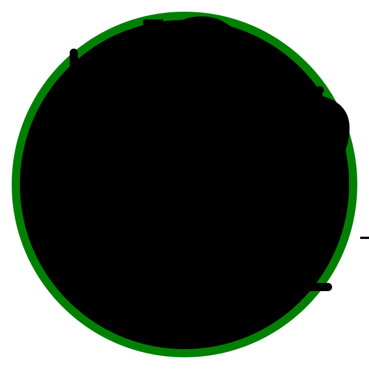

<p align="center">
    <a href="https://mathjslab.com/" target="_blank" rel="noopener"></a>
</p>

# [MathJSLab](https://mathjslab.com/) - [mathjslab.com](https://mathjslab.com/)

[](https://app.netlify.com/sites/mathjslab/deploys)
[](https://dl.circleci.com/status-badge/redirect/gh/MathJSLab/mathjslab-app/tree/main)
[](https://mathjslab.com/)
[](https://github.com/MathJSLab/mathjslab-app)
[](https://github.com/MathJSLab/mathjslab-app/blob/main/LICENSE)
[](https://doi.org/10.5281/zenodo.8396263)
[](https://grp.isbn-international.org/search/piid_solr?keys=978-65-00-84828-1)
[](https://cdn.jsdelivr.net/gh/MathJSLab/mathjslab-app/)

> Un [intérprete](https://es.wikipedia.org/wiki/Int%C3%A9rprete_(inform%C3%A1tica)) con sintaxis de lenguaje como [MATLAB&reg;](https://www.mathworks.com/)/[Octave](https://www.gnu.org/software/octave/) escrito en [TypeScript](https://www.typescriptlang.org/).

**[ISBN 978-65-00-84828-1](https://grp.isbn-international.org/search/piid_solr?keys=978-65-00-84828-1)**

Esta es una aplicación de demostración del [paquete npm](https://es.wikipedia.org/wiki/Npm) [MathJSLab](https://www.npmjs.com/package/mathjslab). Vea esta demostración en la página del proyecto en [mathjslab.com](https://mathjslab.com/). El repositorio está en la [Organización MathJSLab](https://github.com/MathJSLab) en [GitHub](https://github.com/).

**Aviso Importante:** Este software, **[MathJSLab](https://mathjslab.com/), no
está afiliado, patrocinado ni respaldado por [The MathWorks, Inc.](https://www.mathworks.com/)**
[MATLAB&reg;](https://www.mathworks.com/products/matlab.html) es una marca
registrada de [The MathWorks, Inc.](https://www.mathworks.com/) Para más
información sobre [MATLAB](https://www.mathworks.com/products/matlab.html),
visita [www.mathworks.com](https://www.mathworks.com).

Esta [aplicación](https://es.wikipedia.org/wiki/Aplicaci%C3%B3n_web), desarrollada como una [Aplicación Web Progresiva (PWA)](https://es.wikipedia.org/wiki/Aplicaci%C3%B3n_web_progresiva), demuestra las capacidades del paquete [MathJSLab](https://www.npmjs.com/package/mathjslab) en un entorno moderno e interactivo. La interfaz de la [aplicación](https://es.wikipedia.org/wiki/Aplicaci%C3%B3n_web) está estructurada con [Web Components](https://developer.mozilla.org/es/docs/Web/API/Web_components), asegurando modularidad, encapsulación y reutilización eficiente de elementos visuales, lo que facilita el mantenimiento y escalabilidad del proyecto. Además, la [aplicación](https://es.wikipedia.org/wiki/Aplicaci%C3%B3n_web) adopta un [diseño responsivo](https://es.wikipedia.org/wiki/Dise%C3%B1o_web_adaptable), proporcionando una experiencia consistente, independientemente del dispositivo que se utilice, permitiendo que se adapte a diferentes tamaños de pantalla sin comprometer la usabilidad.

La lógica de la [aplicación](https://es.wikipedia.org/wiki/Aplicaci%C3%B3n_web) está escrita en [TypeScript](https://www.typescriptlang.org/), asegurando una tipificación uniforme y estandarizada en todas las partes del código. La [estilización](https://www.w3.org/TR/css/) se organiza a través de plantillas [SASS](https://sass-lang.com/), que estructuran las definiciones de manera más racionalizada y modular, facilitando la personalización, el mantenimiento y la reutilización del código.

Esta aplicación de demostración también utiliza:

* [MathJax](https://www.mathjax.org/) para navegadores sin soporte [MathML](https://www.w3.org/Math/).
* [Marked](https://www.npmjs.com/package/marked) para formatear archivos [Markdown](https://www.markdownguide.org/) como [HTML](https://developer.mozilla.org/es/docs/Web/HTML).
* [Plotly.js](https://plotly.com/javascript/) para generar gráficos, histogramas e gráficos 3D.
* [Mermaid](https://mermaid.js.org/) para generar grafos y diagramas.

## Contribuyendo

Para contribuir a este proyecto, consulte nuestras
[pautas de contribución](https://github.com/MathJSLab/mathjslab-app/blob/main/CONTRIBUTING.md).

Únase al chat de la comunidad:

[](https://matrix.to/#/#mathjslab:gitter.im?utm_source=badge&utm_medium=badge&utm_campaign=pr-badge&utm_content=badge)

## Scripts de compilación

Se definen los siguientes scripts de compilación:

1. **Antes de compilar** `mathjslab-app`, para **iniciar** el área de trabajo del proyecto, ejecute:
```bash
npm run initialize
```
Esto actualizará las dependencias y las instalará todas, preparando todo
recursos necesarios para compilar el proyecto.

Para actualizar las dependencias nuevamente ejecute:
```bash
npm run update
```

2. Para **formatear** y aplicar la **herramienta lint** al código `mathjslab-app`, ejecute:
```bash
npm run format:lint
```

3. **Compile** `mathjslab-app` en **modo de desarrollo** usando:
```bash
npm run build:dev
```

4. **Compile** `mathjslab-app` en **modo de depuración** usando:
```bash
npm run build:debug
```

5. **Compile** `mathjslab-app` en **modo de producción** usando:
```bash
npm run build:prod
```

6. Para **eliminar** todos los archivos de compilación en el área de trabajo, use:
```bash
npm run clean
```

7. Para **eliminar también todas las dependencias**, en el archivo
`package-lock.json` y en el directorio `node_modules`, use:
```bash
npm run clean:all
```
Después de ejecutar este comando, deberá configurar el área de trabajo ejecutando `npm run initialize` nuevamente.

## Comunidad

Únase al chat de la comunidad:

[](https://matrix.to/#/#mathjslab:gitter.im?utm_source=badge&utm_medium=badge&utm_campaign=pr-badge&utm_content=badge)

## Notas sobre Marcas Registradas

- [MATLAB&reg;](https://www.mathworks.com/products/matlab.html) es una marca registrada de [The MathWorks, Inc.](https://www.mathworks.com/)
- [MathJSLab](https://mathjslab.com/) no está afiliado, patrocinado ni respaldado por [The MathWorks, Inc.](https://www.mathworks.com/)

## Licencia

>[MIT License](https://opensource.org/license/mit)
>
>Copyright &copy; 2016-2024 [Sergio Lindau](mailto:sergiolindau@gmail.com), [mathjslab.com](https://mathjslab.com/), [ISBN 978-65-00-84828-1](https://grp.isbn-international.org/search/piid_solr?keys=978-65-00-84828-1)
>
>Permission is hereby granted, free of charge, to any person obtaining a copy
>of this software and associated documentation files (the "Software"), to deal
>in the Software without restriction, including without limitation the rights
>to use, copy, modify, merge, publish, distribute, sublicense, and/or sell
>copies of the Software, and to permit persons to whom the Software is
>furnished to do so, subject to the following conditions:
>
>The above copyright notice and this permission notice shall be included in all
>copies or substantial portions of the Software.
>
>THE SOFTWARE IS PROVIDED "AS IS", WITHOUT WARRANTY OF ANY KIND, EXPRESS OR
>IMPLIED, INCLUDING BUT NOT LIMITED TO THE WARRANTIES OF MERCHANTABILITY,
>FITNESS FOR A PARTICULAR PURPOSE AND NONINFRINGEMENT. IN NO EVENT SHALL THE
>AUTHORS OR COPYRIGHT HOLDERS BE LIABLE FOR ANY CLAIM, DAMAGES OR OTHER
>LIABILITY, WHETHER IN AN ACTION OF CONTRACT, TORT OR OTHERWISE, ARISING FROM,
>OUT OF OR IN CONNECTION WITH THE SOFTWARE OR THE USE OR OTHER DEALINGS IN THE
>SOFTWARE.

