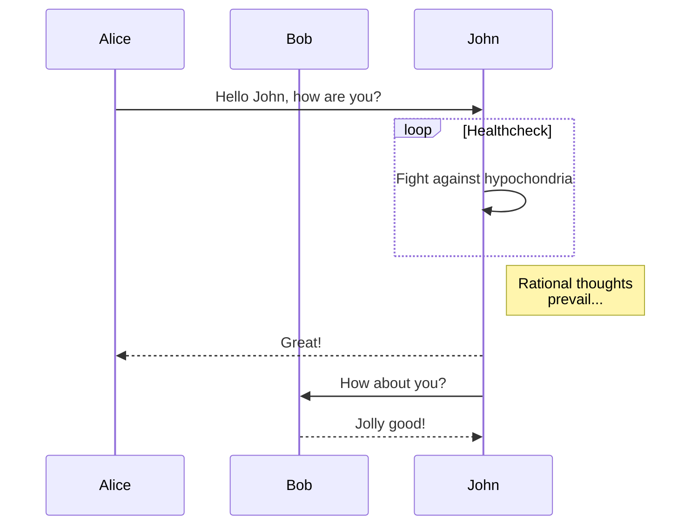
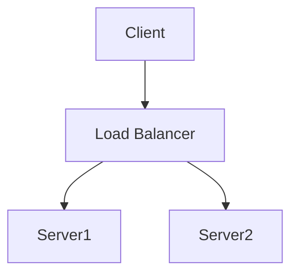
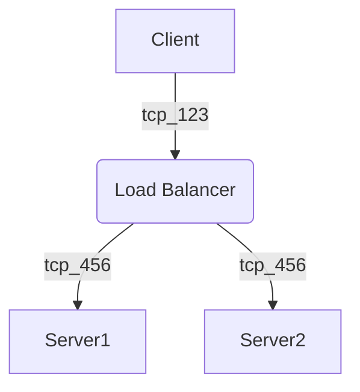

# Markdown renderer

## Test 1 - mermaid



## Test 2 - mermaid



## Test 3 - mermaid



## Test 4 - smiles

```smiles
CN1C=NC2=C1C(=O)N(C(=O)N2C)C
```

## Test 5 - mathjslab

```mathjslab
x = linspace(0, 2*pi, 100);
plot(x, sin(x));
```
