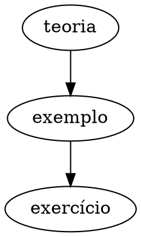

# Extensões educacionais do Markdown

O `MarkdownEngine` mantém o processamento GFM no Marked e ativa renderizadores
especializados somente quando encontra o fence correspondente.

| Família               | Fences                                              | Biblioteca                |
| --------------------- | --------------------------------------------------- | ------------------------- |
| Música simples        | `abc`                                               | abcjs                     |
| Partituras            | `mei`, `musicxml`                                   | Verovio                   |
| Mapas vetoriais       | `geojson`, `topojson`                               | Leaflet e topojson-client |
| Gráficos declarativos | `vega-lite`                                         | Vega-Lite                 |
| Grafos                | `dot`, `graphviz`                                   | Graphviz/Viz.js           |
| Moléculas 3D          | `pdb`, `cif`, `mmcif`, `sdf`, `mol2`, `xyz`, `cube` | 3Dmol.js                  |
| Modelos 3D            | `stl`, `obj`, `gltf`                                | Three.js                  |

Exemplos completos estão em [música](markdown-musica.md),
[mapas](markdown-mapas.md), [Vega-Lite](markdown-vega-lite.md),
[Graphviz](markdown-graphviz.md), [moléculas 3D](markdown-moleculas-3d.md) e
[modelos 3D](markdown-modelos-3d.md). Esses links relativos também exercitam a
navegação do futuro componente.

O contexto do engine controla tema, idioma, dimensões, áudio, resolução de
URLs, política de carregamento, cancelamento, limites de tamanho, resize e
diagnósticos. Cada extensão preserva seu texto-fonte como fallback quando
encontra dados inválidos.

## Nota combinada para teste

```abc
X:1
M:4/4
L:1/4
K:C
C D E F | G A B c |
```



```vega-lite
{"data":{"values":[{"x":"A","y":2},{"x":"B","y":5}]},"mark":"bar","encoding":{"x":{"field":"x"},"y":{"field":"y","type":"quantitative"}}}
```

```geojson
{
    "type": "Feature",
    "properties": {
        "name": "Ponto de estudo"
    },
    "geometry": {
        "type": "Point",
        "coordinates": [
            -46.63,
            -23.55
        ]
    }
}
```

```xyz
3
water molecule
O 0 0 0
H 0.758602 0 0.504284
H -0.758602 0 0.504284
```

```obj
o triangle
v -1 0 0
v 1 0 0
v 0 1 0
f 1 2 3
```
