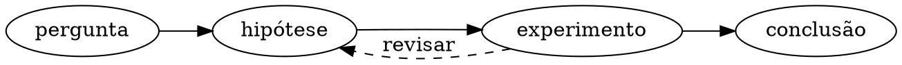

# Graphviz em Markdown

Use `dot` ou `graphviz` para escrever grafos na linguagem DOT. O SVG é gerado
localmente por Graphviz/WebAssembly.

```dot
digraph aula {
  rankdir=LR
  pergunta -> hipótese -> experimento -> conclusão
  experimento -> hipótese [label="revisar", style=dashed]
}
```
