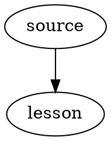

# Core extension renderers


```smiles
CN1C=NC2=C1C(=O)N(C(=O)N2C)C
```

Inline mathematics: $E=mc^2$.

```math
\int_0^1 x^2\,dx = \frac{1}{3}
```



```vega-lite
{
  "$schema": "https://vega.github.io/schema/vega-lite/v6.json",
  "data": {"values": [{"category":"A","value":12},{"category":"B","value":20}]},
  "mark": "bar",
  "encoding": {
    "x": {"field":"category","type":"nominal"},
    "y": {"field":"value","type":"quantitative"}
  }
}
```
