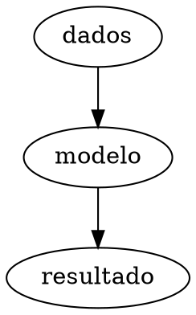

# Aula combinada

Uma fórmula $E=mc^2$, um valor MathJSLab %`sqrt(2)`% e um
[recurso](../resources/values.csv).


```smiles
CCO
```

```abc
X:1
K:C
C D E F | G A B c |
```



```vega-lite
{"data":{"values":[{"x":"A","y":1},{"x":"B","y":3}]},"mark":"bar","encoding":{"x":{"field":"x"},"y":{"field":"y","type":"quantitative"}}}
```

```geojson
{
    "type": "Point",
    "coordinates": [
        -46.63,
        -23.55
    ]
}
```

```xyz
1
hydrogen
H 0 0 0
```

```obj
v 0 0 0
v 1 0 0
v 0 1 0
f 1 2 3
```

```mathjslab
x = 1:5;
y = x.^2;
```
