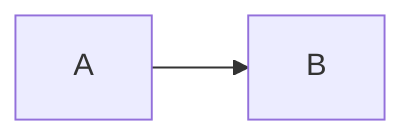

# Conflitos de fences

````markdown

```mermaid
flowchart LR
  A --> B
```
````

````javascript
const literal = "```math";
const percent = "%`not MathJSLab here`%";
````

```math
x^2
```

```mathjslab
x = 2;
```
