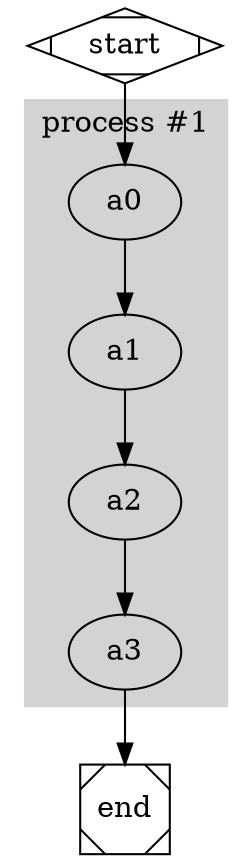
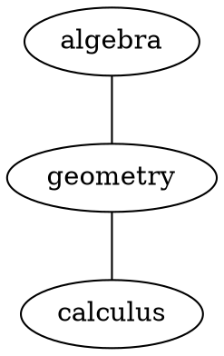

# Graphviz

Exemplo reduzido da galeria oficial de clusters do Graphviz.

```dot
digraph G {
  subgraph cluster_0 {
    style=filled; color=lightgrey; label="process #1";
    a0 -> a1 -> a2 -> a3;
  }
  start -> a0;
  a3 -> end;
  start [shape=Mdiamond];
  end [shape=Msquare];
}
```

```graphviz
graph lesson { algebra -- geometry -- calculus }
```
